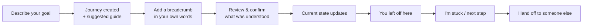
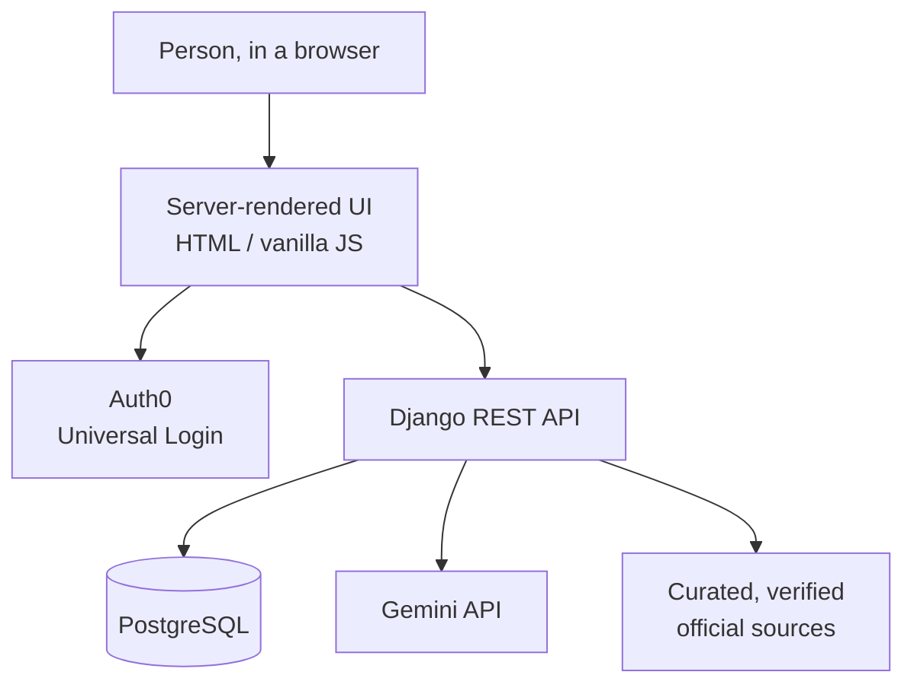

# Breadcrumbs

**One person. One journey. Many services.**
**Pick up where you left off.**

### 🔗 [Live demo — breadcrumbs.select](https://breadcrumbs.select/)

Breadcrumbs is a citizen-first continuity tool for navigating public services. A single goal — extending a permit, getting a health card, settling into a new city — can involve a website, a form, an email, a phone call, a service counter, and more than one level of government. Breadcrumbs helps a person keep track of what happened, what they were told, where they currently stand, and what's known about the next step — and it can turn that into a short handoff so the next person helping them starts with context instead of a blank page.

Built for **Hack the Hill III**, Civic Technology track.

---

## The problem

Getting something done through public services rarely happens in one interaction. A person might apply online, then call to follow up, then get a letter, then visit an office — each step held by a different system, remembered by a different person. The person going through it is usually the only one who remembers the whole story, and if they're unfamiliar with the process, that's genuinely hard to hold onto.

This became visible to us first through international students and newcomers navigating Canadian immigration and settlement processes for the first time — but the underlying need isn't specific to that group. Anyone juggling a multi-step process across institutions, or helping a family member do the same, runs into the same problem: **continuity is the hard part, not any single step.**

## Our solution

Breadcrumbs organizes a person's process around a few simple ideas:

| Concept | What it means |
|---|---|
| **Journey** | The overall goal (e.g. "Extend my work permit") and everything recorded toward it |
| **Breadcrumbs** | Individual recorded events — a call, an email, a letter, a form submitted, an instruction received |
| **You left off here** | A plain-language summary of the current state, derived from what's actually been recorded |
| **Next known step** | What's known to still need doing, based on confirmed evidence, not a guess |
| **I'm stuck** | An on-demand, bounded summary: what happened, what's unresolved, the last instruction, and who's responsible |
| **Responsible organization & official sources** | Where the directory can identify one, a link to a verified official page — with an excerpt and the date it was last checked |
| **Handoff** | A copyable summary generated from confirmed records, ready to give to someone else helping with the case |

## How it works



A person describes their situation in plain language once, in either English or French. Breadcrumbs turns that into a small guide and a running record. Every later event goes through the same "record → review → confirm" loop — nothing becomes part of the record until the person confirms it's accurate.

## Example scenarios

**Starting a work-permit extension, nothing done yet**
> *"I want to extend my work permit. I haven't started anything yet and I'm not sure where to begin."*
Breadcrumbs proposes a guide that starts from square one: understand the process, gather what's needed, submit, confirm.

**Same goal, application already submitted**
> *"I already submitted my application three weeks ago and received confirmation. I haven't heard anything since."*
The same goal produces a *different* guide — one that starts from "wait for a response" and "record any update," not from "begin your application." **Two people can share a goal and still be at different stages, so their next step shouldn't look the same.**

**Describing a situation in French**
> *"Je souhaite prolonger mon permis de travail. Je n'ai encore entrepris aucune démarche."*
Breadcrumbs interprets French input, resolves the correct responsible organization, and returns a guide and official-source links in French — the same functionality as the English path, not a reduced version of it.

**Helping a family member**
A phone call, a letter, or an in-person appointment on someone else's behalf is recorded the same way a self-service action would be — so a caregiver or family member can maintain continuity for someone who isn't managing the process themselves online.

## What Breadcrumbs can and can't do

**Can**
- Organize a citizen-owned Journey and timeline of events
- Record and structure interactions described in plain language (English or French)
- Preserve the person's original wording alongside the structured interpretation
- Show current known state and progress against a suggested guide
- Identify a responsible organization from a curated directory, where one is known
- Link to verified official pages, with an excerpt and a last-checked date
- Produce a handoff summary from confirmed records

**Can't**
- Make a government decision or determine legal/immigration status
- Give legal advice
- Submit an application on someone's behalf
- Invent a department, deadline, fee, or contact that isn't verified
- Access a private government case file
- Claim a live official case status it has no authoritative source for
- Act as an open-ended general-purpose chatbot

## Responsible AI

This is a deliberate design position, not an afterthought:

- **AI helps interpret; it isn't the source of truth.** The person's original words are always kept alongside whatever the model extracted from them.
- **Nothing becomes evidence without confirmation.** A model's reading of a sentence is a draft the person reviews and accepts (or corrects) before it's saved — generated text is never silently written into the record.
- **Generated output never feeds back into another model call.** One user action produces at most one AI call; a summary is never re-summarized.
- **Every record carries a provenance label** — Official, User-reported, Community, or AI-interpretation — so it's always clear where a piece of information came from.
- **Uncertainty is stated, not hidden.** If a detail is missing, Breadcrumbs asks one focused clarifying question rather than guessing; if no organization can be confidently identified, it says so instead of naming one.
- **Conversation is bounded on purpose.** An unrelated request (or an attempt to redefine the assistant's role) gets a deterministic response pointing back at what the tool actually does — not an open-ended reply.

## How Gemini is used

Gemini is used for a small number of specific, bounded tasks:
- Turning a plain-language goal description into a structured Journey and a suggested guide
- Extracting structured details (who, what, channel, status, instruction) from a described event
- Picking, at most, one verified excerpt to support a specific guide step's claim — never inventing a source
- Optional, on-request rewording of an already-assembled summary ("I'm stuck" / handoff), which can add no new facts

**Most of the product needs zero AI calls.** Viewing a timeline, loading a Journey, checking current state, editing or deleting a confirmed record, and looking up an official source are all plain reads or writes against the database — this was a deliberate choice for reliability, cost control, and to avoid a model's output ever feeding back into itself. A deterministic, rule-based fallback (keyword/date/organization matching) covers Journey and breadcrumb creation whenever Gemini is disabled, rate-limited, or unavailable, so the app keeps working end-to-end without it.

## Guest access & sign-in

Anyone can try Breadcrumbs immediately as a guest — no account needed. A guest gets a private, cookie-backed session (expiring after 7 days) with a small usage allowance, so they can experience the product before deciding to create an account.

Signing in uses **Auth0**, with Google as a social sign-in option through Auth0's Universal Login. Signing in migrates a guest's existing Journey onto the account (a one-time, idempotent operation) and lifts the guest-level usage limits. Usage limits on both guest and signed-in tiers exist to keep a shared Gemini quota available to everyone trying the demo.

## Technology stack

- **Backend:** Django, Django REST Framework, PostgreSQL (SQLite for local development)
- **Frontend:** server-rendered templates with vanilla JavaScript and CSS — no build step, framework, or transpiler
- **AI:** Google Gemini API, with a deterministic rule-based fallback service implementing the same contract
- **Auth:** Auth0 (Universal Login, Google social connection), validated server-side via RS256 JWT
- **Localization:** Django `gettext` for backend text, a small client-side dictionary for the frontend — English and French
- **Deployment:** Render (Blueprint-defined web service + managed PostgreSQL), custom domain `breadcrumbs.select` via GoDaddy
- **API docs:** OpenAPI schema via drf-spectacular

## Architecture



A **modular monolith**: one Django project, two focused apps (`journeys` and `directory`), and a single `services/ai` layer providing one interface with two implementations (Gemini-backed and rule-based). This was the right tradeoff for a hackathon timeline — simpler to build, test, and deploy than a services split — while still keeping AI, domain logic, authentication, and persistence in clearly separated modules rather than tangled together.

```
backend/
├── apps/journeys/     Journey + Breadcrumb, state derivation, "I'm stuck", handoff
├── apps/directory/    Curated organizations, official sources, and source verification
├── services/ai/       One AI interface, two implementations, the scope/injection gate, prompts
├── common/            Error handling, guest/Auth0 authentication, rate limiting
└── demo/              The actual frontend: templates, JS, CSS, i18n dictionaries
```

## Why we made these decisions

**Why not just a chatbot?** The valuable thing is a persistent, structured Journey — not a conversation transcript. A chat log can't reliably answer "what did I actually submit, and when."

**Why citizen-first?** It creates continuity without needing any public institution to adopt or integrate anything. The tool is useful on day one, independent of legacy systems.

**Why start with newcomer scenarios?** They make the need for guidance through an unfamiliar process especially visible — but the product itself works for anyone managing a multi-step process, not just newcomers.

**Why limit AI so deliberately?** Structured application logic is predictable, fast, and auditable in a way a model call isn't. AI earns its place only where natural-language understanding adds real value — reading a sentence — not for storage, retrieval, or navigation.

**Why guest mode?** A civic tool should let someone see its value before asking them to create an account.

**Why Auth0?** Secure sign-in and Google social login without building and maintaining identity infrastructure ourselves.

**Why Render and a custom domain?** A simple, public, one-click deployment story and a memorable URL for a hackathon demo.

## Challenges and what we learned

- **Live Gemini calls in an automated test suite is a quota trap.** An early version of the test suite could reach the real API; a single retry-on-any-error bug burned a day's free-tier quota in minutes. We restructured so `manage.py test` always runs against a mocked/rule-based path, and live-model verification lives in separate, explicitly opt-in commands (`verify_gemini`, `eval_gemini`) that never run automatically.
- **A live evaluation caught what mocked tests couldn't.** Running real, varied prompts through Gemini surfaced inconsistent judgment about when a detail needs clarifying — something no hand-written mock would expose. We turned that into invariants enforced on the data contract itself, so they hold regardless of which engine produced a draft.
- **The same goal doesn't mean the same next step.** Making the guide reflect a person's actual stage — not just their goal — took explicit design and testing (see the two work-permit scenarios above) rather than falling out of a single generic prompt.
- **Two features can target the same weak spot from different angles.** Reliable official-source linking was improved from two directions in parallel — better organization matching (including full French-language support) and a citation-grounding system that verifies and re-checks source pages over time. Bringing both together took deliberately reconciling how they share the same underlying organization-resolution step, rather than picking one and discarding the other.
- **Bilingual support isn't a translation pass.** Word order, gendered articles, and pluralization meant the deterministic fallback needed real French logic, not templated string substitution — closer to a second small effort than a find-and-replace.

## Judge FAQ

**Why isn't this just ChatGPT?** ChatGPT has no memory of what you actually did, on what date, or what you were told. Breadcrumbs' value is the structured, persistent record — the model is one small step in filling it in, not the product.

**Why isn't this just a notes app?** A notes app doesn't derive your current state, suggest a next step, identify a responsible organization, or generate a handoff from what you wrote — Breadcrumbs treats your notes as structured evidence, not free text.

**Does Breadcrumbs give immigration or legal advice?** No. It never asserts a legal status, eligibility outcome, or official decision — see "What Breadcrumbs can't do" above.

**What happens if Gemini gets something wrong?** Nothing is saved until the person reviews and confirms it. A wrong draft is corrected or discarded before it ever becomes part of the record.

**How do you prevent hallucination?** Structured output is schema-validated, organizations are matched only against a curated directory (never invented), and any factual claim in a guide step must be backed by a specific, verified source excerpt or it's left out.

**How do you prevent people from abusing the AI?** Rate limits and daily quotas apply per guest session and per account, and most of the product's functionality doesn't touch the model at all, so there's little incentive or ability to spam it.

**Does this need a government API integration?** No. Breadcrumbs works entirely from what the citizen records and a small, human-curated directory of public official sources — no institutional cooperation required to be useful.

**How does this bring people and institutions closer together?** By giving the person a clear, accurate account of their own situation, the next official they reach — a call centre agent, a caseworker, a family member helping out — gets a better starting point than a confused retelling.

**Why is the newcomer scenario in the demo if the tool is for everyone?** It's the scenario that makes an unfamiliar, multi-step process especially visible and easy to demonstrate — not a restriction on who it's for.

**What happens if Gemini is unavailable?** A deterministic, rule-based engine covers the same actions — Journey creation, event interpretation — so the app keeps working end-to-end, just without model-assisted phrasing.

## Running locally

```bash
cd backend
python -m venv .venv
.venv/Scripts/python.exe -m pip install -r requirements.txt   # Windows
# source .venv/bin/activate && pip install -r requirements.txt  # macOS/Linux

.venv/Scripts/python.exe manage.py migrate
.venv/Scripts/python.exe manage.py seed_demo
.venv/Scripts/python.exe manage.py runserver
```

Then open **http://127.0.0.1:8000/demo/**. API docs are at `/api/docs/`.

No API key, external database, or network access is required to run the whole thing — SQLite is the default, and the deterministic fallback covers every AI-backed action. Copy `backend/.env.example` to `backend/.env` to configure anything (Gemini key, Auth0 tenant, PostgreSQL URL); every value has a working default, and no real secrets belong in the repository.

To enable Gemini locally, set `GEMINI_API_KEY` and `AI_ENABLED=true` in `.env`. To enable sign-in, set `AUTH0_DOMAIN`, `AUTH0_CLIENT_ID`, and `AUTH0_AUDIENCE`; guest mode works without them.

### Tests

```bash
cd backend
.venv/Scripts/python.exe manage.py test
```

216 tests, no network access required — `manage.py test` forces AI off regardless of `.env`, so a live key can never make the suite flaky or quota-dependent.

## Try it — a short demo path

1. Open **[breadcrumbs.select](https://breadcrumbs.select/)**.
2. Continue as a guest, or sign in with Google.
3. Describe a goal in your own words (try it in French, too).
4. Look at the suggested guide it creates.
5. Add something that happened, in plain language.
6. Review how it was understood, and confirm it.
7. Watch the current state and guide progress update.
8. Press **I'm stuck** for a bounded summary of where things stand.
9. Press **Hand me off** to generate a copyable case summary.

## Future direction

- Extending the curated directory to more public-service domains
- Delegated, permissioned access for a family member or caregiver
- Selective, temporary sharing of a Journey (rather than a full account)
- Additional languages beyond English and French
- Aggregated, privacy-preserving patterns that could help institutions understand common friction points across journeys — without exposing any individual's record

---

**All demo data is synthetic.** Nothing here is an official government record.
